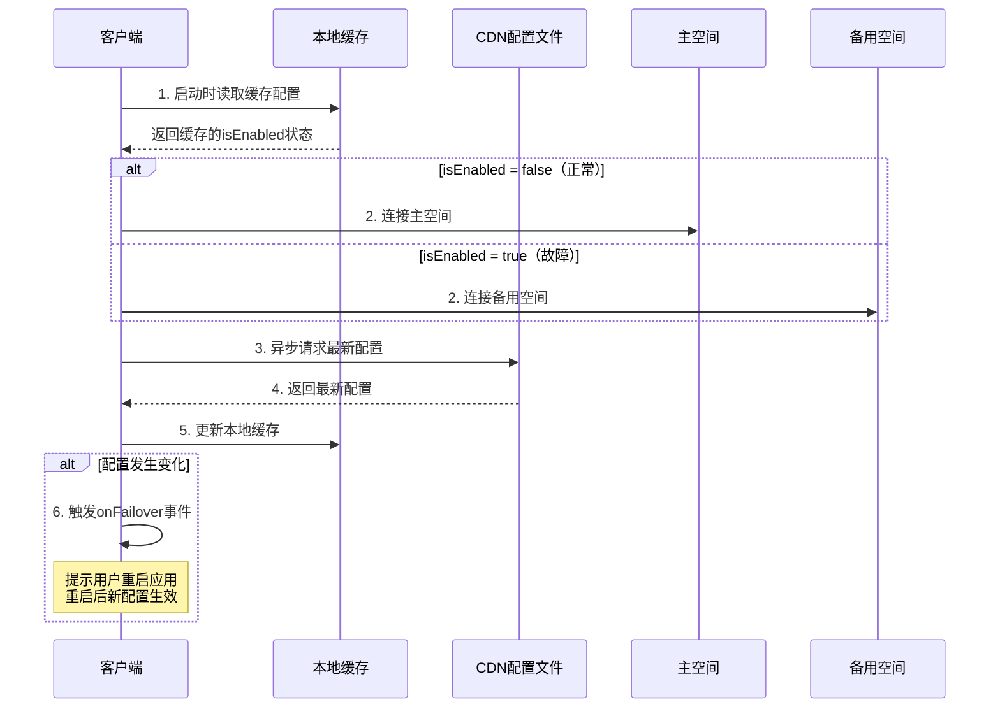

# 服务空间故障切换

> 新增于 HBuilderX 5.x

服务空间故障切换是uniCloud跨云灾备方案的核心能力，当主服务空间发生故障时，可以切换到备用服务空间，确保业务连续性。

关于跨云灾备的完整方案介绍，请参考：[uniCloud跨云灾备方案](disaster-recovery.md)

## 前置准备

使用故障切换功能前，需要完成以下准备工作：

### 1. 准备备用服务空间

1. 在不同云服务商（如阿里云、腾讯云、支付宝云）创建一个服务空间，推荐使用阿里云或者支付宝云。
2. 备用空间建议购买按量付费套餐，不使用时不会产生费用。
3. 在备用空间中不建议部署云函数/云对象代码，仅作为故障切换的备用空间使用。

### 2. 开通扩展数据库

统一使用uni扩展数据库，确保主备空间访问同一份数据，避免数据不一致问题。

关于uni扩展数据库的介绍，请参考：[uni扩展数据库](ext-mongodb/intro.md)

如何开通uni扩展数据库，请参考：[开通uni扩展数据库](ext-mongodb/service.md)

开通扩展数据库后，需要授权主空间和备用空间访问数据库，具体操作请参考：[扩展数据库跨空间授权](ext-mongodb/dev.md#space-auth)

### 3. 开通扩展存储

故障切换的配置文件存储在CDN上，需要在主空间开通uni扩展存储服务。

如使用了云存储功能，建议将云存储切换到扩展存储。

关于uni扩展存储的介绍，请参考：[uni扩展存储](ext-storage/intro.md)

如何开通uni扩展存储，请参考：[开通uni扩展存储](ext-storage/service.md)

### 4. 项目发行配置

要在服务空间相关联的项目中使用故障切换功能，必须在uniCloud控制台-故障切换中配置"服务接入点"后，**重新关联服务空间并重新发行项目生效**。

本地调试时需要重新关联服务空间并切换到云端才会生效。

## 控制台操作

故障切换功能在uniCloud控制台服务空间详情页面的左侧"故障切换"菜单中进行配置和管理。


### 配置服务接入点

服务接入点是接入故障切换功能的基础，本质上是绑定扩展存储中的CDN域名。

**未开通扩展存储**

如果未开通扩展存储服务，请按照提示开通扩展存储并绑定CDN域名。


**已开通扩展存储**

如果已开通扩展存储，请选择对应的CDN域名作为服务接入点，点击保存。

保存服务节点后，在HBuilderX中重新关联服务空间并重新发行项目时会将故障切换功能集成到客户端SDK中。


### 切换到备用空间

当主空间发生故障时，切换服务空间状态为"故障"


选择备用服务空间后，点击“应用”按钮，系统将主空间云函数、公共模块、Schema迁移至备用空间。

**注意**

1. 切换过程中会同步主空间云函数至目标空间，目标空间有同名云函数、schema将覆盖，在此期间请勿上传云函数。
2. 故障期间如需修改云函数代码，请手动切换至目标空间上传。
3. 如主空间中使用了付费云函数，需要在切换前重新购买至目标空间，防止切换后付费云函数无法使用。
4. 主空间如果存在定时任务，迁移时会暂停主空间定时任务，自动在备用空间创建相同的定时任务执行。

### 切换到主空间

当主空间恢复正常后，切换服务空间状态为"正常"


选择服务空间状态为"正常"，点击“应用”按钮，系统将备用空间云函数、公共模块、Schema迁移回主空间。

## 客户端 API

### uniCloud.onFailover(listener)

监听故障切换事件。当故障切换状态发生变化时触发。

**参数说明**

|参数名|类型|必填|说明|
|---|---|---|---|
|listener|Function|是|事件监听函数|

**listener回调参数**

|参数名|类型| 说明                                |
|---|---|-----------------------------------|
|isEnabled|Boolean| 是否启用故障切换（`true`表示需要切换到备用空间，重启后生效） |
|failoverSpace|Object| 备用服务空间配置                          |
|hasStatusChanged|Boolean| 状态是否发生变化（相比本地缓存的配置）               |

> 注意：当`hasStatusChanged`为`true`时，表示配置发生了变化，需要提示用户重启应用使新配置生效。

**示例**

```js
// 在 App.vue 的 onLaunch 中监听
uniCloud.onFailover(function(event) {
  console.log('故障切换事件触发')
  console.log('最新配置状态:', event.isEnabled ? '需要使用备用空间' : '使用主空间')
  console.log('状态是否变化:', event.hasStatusChanged)

  if (event.hasStatusChanged) {
    // 配置发生变化，必须重启应用才能使新配置生效
    uni.showModal({
      title: '服务状态变更',
      content: event.isEnabled ? '检测到服务故障，需要重启应用切换到备用服务' : '服务已恢复正常，需要重启应用切换回主服务',
      confirmText: '立即重启',
      cancelText: '稍后',
      success: (res) => {
        if (res.confirm) {
          // 重启应用使新配置生效
          // #ifdef APP-PLUS
          plus.runtime.restart()
          // #endif
          // #ifdef H5
          location.reload()
          // #endif
        }
      }
    })
  }
})
```

### uniCloud.offFailover(listener)

移除故障切换事件监听。

**参数说明**

|参数名|类型|必填|说明|
|---|---|---|---|
|listener|Function|是|要移除的监听函数，必须与添加时的函数引用一致|

**示例**

```js
// 正确用法：使用同一个函数引用
function failoverHandler(event) {
  console.log('故障切换:', event)
}

// 添加监听
uniCloud.onFailover(failoverHandler)

// 移除监听
uniCloud.offFailover(failoverHandler)
```

```js
// 错误用法：无法移除
uniCloud.onFailover(function(event) {
  console.log(event)
})
uniCloud.offFailover(function(event) {
  console.log(event)  // 这是一个新的函数，无法移除上面的监听
})
```

## 使用场景

### 场景一：强制重启切换（推荐）

当检测到配置变化时，强制用户重启应用以确保切换生效。

```js
// App.vue
export default {
  onLaunch() {
    uniCloud.onFailover((event) => {
      if (event.hasStatusChanged) {
        // 配置变化，必须重启才能生效
        uni.showModal({
          title: '服务状态变更',
          content: event.isEnabled
            ? '检测到服务异常，需要重启应用切换到备用服务'
            : '服务已恢复，需要重启应用切换回主服务',
          showCancel: false,
          confirmText: '立即重启',
          success: () => {
            // #ifdef APP-PLUS
            plus.runtime.restart()
            // #endif
            // #ifdef H5
            location.reload()
            // #endif
          }
        })
      }
    })
  }
}
```

### 场景二：可选重启切换

让用户选择是否立即重启，适用于非紧急切换场景。

```js
// App.vue
export default {
  onLaunch() {
    uniCloud.onFailover((event) => {
      if (event.hasStatusChanged) {
        uni.showModal({
          title: '提示',
          content: '服务状态已更新，重启应用后生效',
          confirmText: '立即重启',
          cancelText: '稍后',
          success: (res) => {
            if (res.confirm) {
              // #ifdef APP-PLUS
              plus.runtime.restart()
              // #endif
              // #ifdef H5
              location.reload()
              // #endif
            }
            // 用户选择稍后，下次启动应用时会使用新配置
          }
        })
      }
    })
  }
}
```

### 场景三：静默记录

仅记录状态变化，不打扰用户。用户下次自然重启应用时会自动使用新配置。

```js
// App.vue
export default {
  onLaunch() {
    uniCloud.onFailover((event) => {
      // 仅记录日志，不提示用户
      console.log('故障切换配置更新:', {
        isEnabled: event.isEnabled,
        hasStatusChanged: event.hasStatusChanged
      })
      // 用户下次重启应用时会自动使用新配置
    })
  }
}
```

## 工作原理



**切换机制说明：**

故障切换采用**下次启动生效**的机制，确保应用运行的稳定性：

1. **启动时读取缓存**：应用启动时，SDK首先读取本地缓存的故障切换配置，根据缓存配置决定使用主空间还是备用空间
2. **异步获取最新配置**：启动后SDK会异步从CDN请求最新的故障切换配置文件
3. **检测配置变化**：将最新配置与本地缓存对比，如果状态发生变化（如从正常变为故障），触发`onFailover`事件
4. **通知用户重启**：开发者在`onFailover`事件中提示用户重启应用，**重启后新配置才会生效**
5. **故障检测**：云函数/云对象/clientDB请求失败时，会自动触发配置刷新，获取最新状态

> **重要**：当检测到配置变化时，当前运行的应用仍使用原来的服务空间。必须重启应用（App重启或H5刷新页面）后，新的配置才会生效。

## 配置文件格式

故障切换配置文件存储在CDN上，路径为 `.unicloud/failover-cfg.json`，格式如下：

```json
{
  "enable": false,
  "interval": 300,
  "space": {
    "provider": "aliyun",
    "spaceId": "mp-xxxxxxxx",
    "clientSecret": "xxxxxxxxxxxx"
  },
  "_lastModifiedAt": 1702627200000
}
```

**字段说明**

|字段|类型| 说明                                         |
|---|---|--------------------------------------------|
|enable|Boolean| 是否启用故障切换。`true`表示主空间故障，使用备用空间；`false`表示使用主空间 |
|interval|Number| 配置刷新间隔（秒）。`0`表示每次请求都检查；正数表示间隔时间；           |
|space|Object| 备用服务空间配置                                   |
|space.provider|String| 云服务商，可选值：`aliyun`、`alipay`、`tcb`           |
|space.spaceId|String| 服务空间ID                                     |
|space.clientSecret|String| 客户端密钥                          |
|_lastModifiedAt|Number| 配置最后修改时间戳（毫秒）                              |


## 注意事项

1. **重启生效**：故障切换配置变化后，必须重启应用（App重启或H5刷新页面）才能生效。当前运行的应用会继续使用原来的服务空间，直到下次启动

2. **发行要求**：故障切换功能仅在HBuilderX发行后的应用中生效，运行到浏览器或模拟器时不会加载故障切换配置

3. **本地缓存**：SDK会将配置缓存到本地存储，应用启动时优先使用缓存配置。即使CDN不可访问也能使用最近一次的配置

4. **首次启动**：首次安装的应用没有缓存配置，会使用项目发行时配置的默认服务空间（主空间）

5. **刷新间隔**：合理设置`interval`参数，避免频繁请求CDN造成不必要的流量消耗

6. **云函数同步**：确保主备空间的云函数、云对象代码保持一致，避免切换后出现功能异常

7. **数据一致性**：使用uni扩展数据库确保主备空间访问同一份数据，避免数据不一致问题

## 相关文档

- [uniCloud跨云灾备方案](disaster-recovery.md)
- [uni扩展数据库](ext-mongodb/intro.md)
- [uni扩展存储](ext-storage/intro.md)
- [uniCloud客户端SDK](client-sdk.md)
