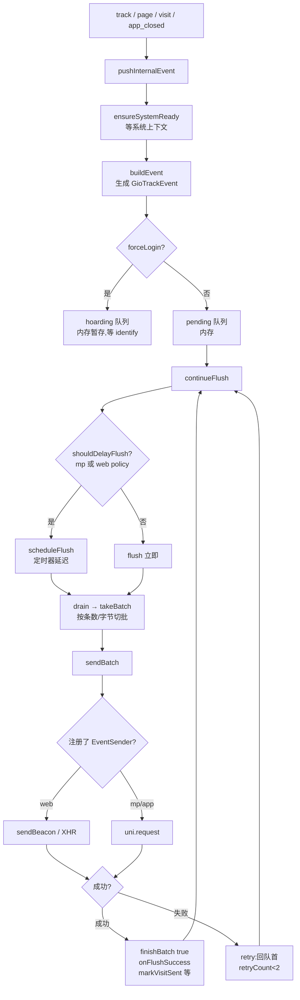
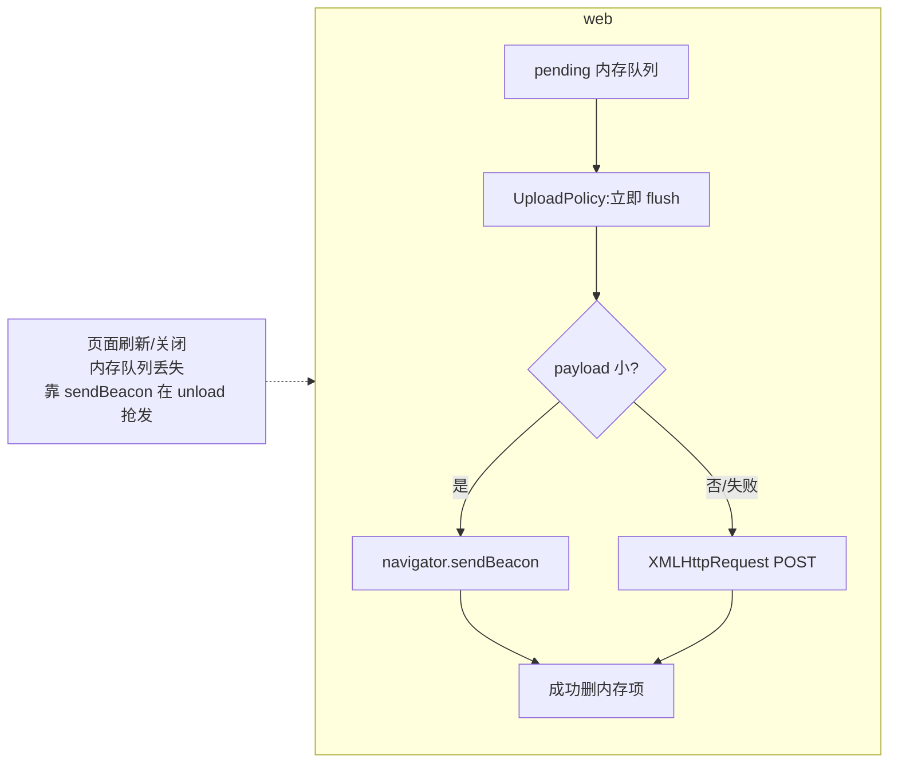
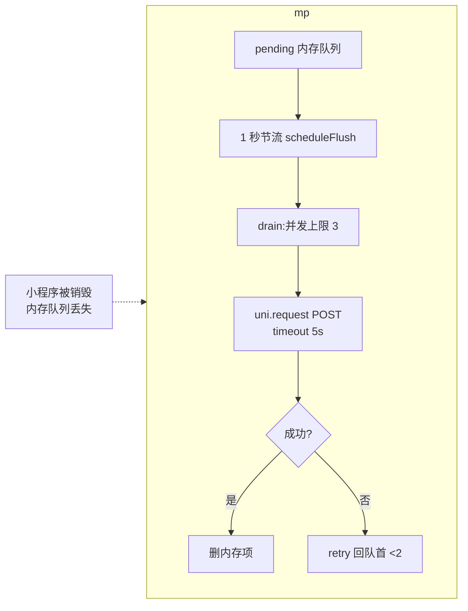
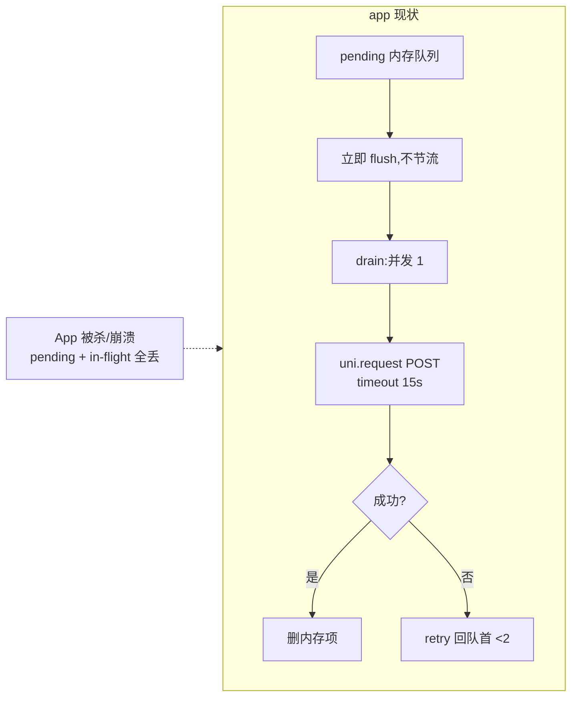
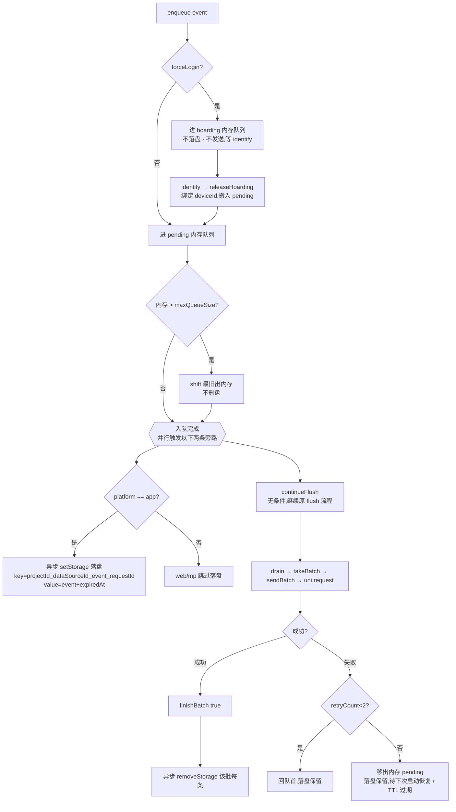
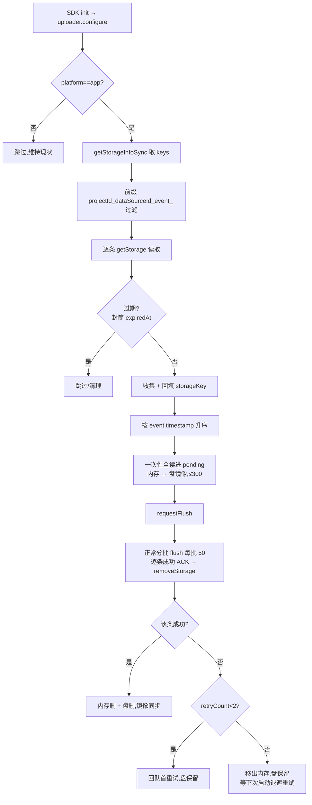

# App 端事件本地持久化设计方案

> 目标:在 app 端(iOS / Android / HarmonyOS)为事件上报增加本地持久化,**发送前先落盘、收到 ACK 后再删除**(at-least-once),提升 SDK 稳定性,做到**事件不丢失**;**不重复**最终由服务端去重兜底。
>
> web / mp 端维持现状,本文档同时画出三端流程以便对比。

---

## 1. 背景:三端上报通道差异

所有端的事件构建上游是一致的:

```
track / page / visit / app_closed
  → GioTracker.pushInternalEvent
  → dataStore.ensureSystemReady（等系统上下文 ready）
  → dataStore.buildEvent（构建 GioTrackEvent）
  → uploader.enqueue(event)
  → flushAfter ? requestFlush()/flush() : 等待
```

差异只发生在 `GioUploader` 内部,由 `runtime` 注册表按端注入:

| 维度 | web | mp（小程序） | app（现状） |
|---|---|---|---|
| 发送通道 | `EventSender`:`sendBeacon` 优先,失败回退 `XMLHttpRequest` | 默认 `uni.request`(POST) | 默认 `uni.request`(POST) |
| 是否节流 | `UploadPolicy.shouldScheduleFlush=true`,但 `getFlushDelay=0`（近似立即） | `isMpRuntime()` → 1 秒节流 | 不节流,立即 flush |
| 并发数 | 1 | `MAX_MP_CONCURRENCY = 3` | 1 |
| 批量条数 | `MAX_WEB_UPLOAD_BATCH_SIZE` | 默认 `MAX_BATCH_EVENTS = 50` | 默认 `MAX_BATCH_EVENTS = 50` |
| 批量字节上限 | `MAX_BEACON_PAYLOAD_BYTES` | `512KB` | `512KB` |
| 请求超时 | 由浏览器 / beacon 决定 | `5000ms` | `15000ms` |
| 失败重试 | 回队首,最多 `MAX_RETRY_COUNT = 2` 次 | 同左 | 同左 |
| 队列上限 | `DEFAULT_MAX_QUEUE_SIZE = 100`,超出 `shift()` 丢最旧 | 同左 | 现状 100;**本方案 app 提至 300 并与落盘镜像**(见 §4.5) |
| **事件队列持久化** | ❌ 仅内存 | ❌ 仅内存 | ❌ 仅内存 → ✅ **本方案新增** |
| 其他持久化 | `VisitSessionStore` / `PlatformStorageFactory`(session / originalSource,**非事件队列**) | 默认 `uni.*StorageSync`(session 等上下文) | 同 mp |

> 结论:三端的事件队列当前**全部只在内存里**,进程被杀 / 崩溃即丢。本方案只给 app 端补事件队列持久化,不改三端共用的上报主链路。

---

## 2. 现状流程图(三端对比)

### 2.1 上报主链路(三端共用)



> 进程被杀点:`pending` 内的事件(未发出)、in-flight 请求(已发未回执)在三端**均直接丢失**。

### 2.2 web 分支特征



### 2.3 mp(小程序)分支特征



### 2.4 app 分支特征(现状)



---

## 3. 丢失 / 重复分析

| 编号 | 场景 | 现状结果 | 本方案 |
|---|---|---|---|
| L1 | `pending` 中未发出即被 kill / crash | 丢失 | ✅ 落盘可恢复 |
| L2 | 请求 in-flight 中被 kill(已发未回执) | 丢失或重复 | ✅ 落盘可恢复重发 |
| L3 | 重试 2 次用尽被丢弃 | 丢失 | ✅ **不删盘**,仅移出内存,下次启动恢复重试 |
| L4 | 队列超上限 `shift()` 丢最旧 | 丢失 | ✅ **不删盘**,仅移出内存,下次启动恢复(落盘另有 TTL / 容量上限) |
| D1 | 发送成功 → 删除前被 kill → 下次重发 | 重复 | ⚠️ **靠服务端去重** |
| D2 | in-flight 服务端已收、回执丢失 → 当失败重发 | 重复(现已存在) | ⚠️ **靠服务端去重** |

> **不重复的根基**:服务端用现有字段(`eventSequenceId` + `sessionId` + `timestamp`)做幂等去重。因此 SDK **原样重发已构建好的事件**,不重建时间戳 / 序号,保证同一事件每次 payload 一致 → 命中去重。

---

## 4. 方案设计(app 端)

### 4.1 关键决策

| 项 | 选择 | 理由 |
|---|---|---|
| 生效范围 | 仅 `platformName() == 'app'` | web / mp 维持现状 |
| 协议 | 不变,原样重发 | 服务端用现有字段去重 |
| 读写时机 | **全异步** `setStorage` / `removeStorage` | 优先流畅,不卡顿 |
| 存储结构 | **一事件一 key** | 抗损坏(坏一条只丢一条)、删除是单 key 操作 |
| 排序键 | `event.timestamp` | 所有事件非 null;同毫秒并列可接受 |
| 内存/盘容量 | app 内存上限 = 落盘上限 = **300**(镜像) | 启动全读、无补读循环 / 容量饿死 |
| TTL | `dataValidityPeriod`(天,默认 7,clamp [3,30]) | 防僵尸事件永久重发 |

### 4.2 新增初始化配置 `dataValidityPeriod`

- 类型 `number`,单位**天**,默认 **7**,**仅 app 生效**(其他端解析但不使用)。
- 推导持久化封筒 `expiredAt`:`expiredAt = now() + dataValidityPeriod * 24*60*60*1000`。
- 取值范围 clamp 到 **[3, 30]**(天):

```ts
// period range is [3, 30]
if (dataValidityPeriod < 3) {
  dataValidityPeriod = 3
} else if (dataValidityPeriod > 30) {
  dataValidityPeriod = 30
}
```

### 4.3 存储结构(一事件一 key)

```
key   = `${projectId}_${dataSourceId}_event_${requestId}`   // event 字面量标识事件 key;requestId = enqueue 已生成的 guid
value = setItem 既有封筒 { value: <GioTrackEvent 原样>, expiredAt }
```

key 各部分职责:

- `projectId` + `dataSourceId`:**双维度命名空间隔离**,启动恢复时只捞当前项目 + 数据源的事件,避免跨项目 / 跨数据源误重发。
- `event`:**事件 key 字面标识**,`getStorageInfoSync()` 返回全空间 key,靠前缀 `${projectId}_${dataSourceId}_event_` 从宿主 App 与 SDK 其他存储里筛出事件队列。
- `requestId`:**唯一删除标识**(单 key 精准删);重试期间复用同一值,删除时能对上。
- `event.timestamp`(在 value 里):启动恢复时的排序键。
- `expiredAt`(在 value 里):由 `dataValidityPeriod` 推导,封筒读取时自动剔除过期项。

### 4.4 数据结构改动

`GioQueuedEvent` 增加字段:

```ts
type GioQueuedEvent = {
  requestId : string
  retryCount : number
  event : GioTrackEvent
  storageKey : string | null   // 新增:落盘 key,用于精准删除
}
```

### 4.5 钩子点(全异步 / try-catch 包裹 / 绝不阻塞发送)

| 时机 | 操作 |
|---|---|
| `enqueue`(非 forceLogin,进 `pending`) | 异步 `setStorage` 写入 |
| `releaseHoarding`(hoarding → pending,已绑定 deviceId) | 异步写入 |
| `finishBatch(success)` | 该批每条异步 `removeStorage`(唯一的成功删盘点) |
| `retry` 上限耗尽(`retryCount >= MAX_RETRY_COUNT`) | **不删盘**,仅移出内存 `pending`;落盘保留,待下次启动恢复 / TTL 过期 |
| overflow `shift()` 内存超 300 | 内存 `shift` 最旧 + 落盘环形删最旧(**同步删同一条**,保新弃旧) |
| `configure`(init) | 异步加载 → 按 `timestamp` 升序**一次性全读进 `pending`**(≤300)→ `requestFlush()` |

> **核心语义:app 端内存 `pending` 与落盘镜像(上限同为 300)。** 事件只有在 ① 发送成功 ACK、② TTL(`dataValidityPeriod`)过期、或 ③ 落盘满 300 环形覆盖(保新弃旧)时才离开盘。`retry` 上限只影响「本会话内存里怎么调度」、**不决定事件存亡**(耗尽只是移出内存、盘仍保留,等下次启动)——这正是 app 与 web/mp「重试耗尽即丢弃」语义的根本区别。

> 落盘容量治理(唯一的非成功删盘途径):
> - **TTL 过期**:封筒 `expiredAt` 到期自动剔除。
> - **最大条数 `MAX_PERSISTED_EVENTS = 300`**:app 端**内存队列上限与落盘上限统一为 300**(内存 ↔ 盘镜像),超过时内存 `shift` + 落盘环形**同步删最旧**(保新弃旧)。web/mp 维持内存 `DEFAULT_MAX_QUEUE_SIZE = 100`、不落盘。
>
> **内存 ↔ 盘镜像(app)**:内存 `pending` 与落盘是同一批事件的两个副本,上限同为 300。启动恢复**一次性把盘上全部(≤300)读进内存**(内存只是工作集、无存储硬限,峰值 ~300 个事件对象 ≈ 几百 KB),所有积压都进发送队列,正常分批(每批 `MAX_BATCH_EVENTS = 50`)flush 发完、逐条 ACK 删盘。**无补读循环、无容量饿死**。唯一「移出内存但留盘等下次启动」的是**重试耗尽**的事件 —— 这是合理退避(持续失败时本会话再发也大概率失败)。`MAX_BATCH_EVENTS = 50` 只是单次请求批量,与队列容量无关。

> `forceLogin` 的 `hoarding` **不持久化**(deviceId 未定),等 `releaseHoarding` 进 `pending` 时才落盘(此时已绑定 deviceId)。

### 4.6 app 新方案 —— 写入与发送路径



> 读图要点:
> - **forceLogin** 是唯一让事件「既不落盘也不发」的分支 —— 它进 `hoarding` 干等,直到 `identify` 触发 `releaseHoarding` 搬入 `pending`(此时才落盘)。
> - 进 `pending` 后,`continueFlush()` **无条件执行**(这就是"继续原 flush 流程");`setStorage` 落盘是**仅 app** 的并行旁路,二者不互斥、互不阻塞。
> - `overflow shift` 和 `retry 耗尽` 都只动内存、**不删盘**;唯一的删盘点是发送成功后的 `removeStorage`(及 TTL 过期 / 落盘容量上限)。

### 4.7 app 新方案 —— 启动恢复路径



### 4.8 临界场景:启动恢复 + 并发新事件(盘已满 300)

app 端内存 `pending` 与落盘**镜像**,上限同为 300。启动恢复**一次性全读进内存**,内存与盘内容一致。离线期间盘恒为 300 满。此时若持续产生新事件:

| 时刻 | 动作 | 内存 | 盘 |
|---|---|---|---|
| T1 | 恢复全读 300 进内存(不删盘),内存 ↔ 盘镜像 | 300 | 300 |
| T2 | 离线 / 发送慢,未成功删盘 | 300 | 300 |
| T3a | 新事件 N 入队,内存 >300 → `shift` 最旧出内存(**不删盘**) | 300 | 300 |
| T3b | N 落盘,盘满 300 → **环形删最旧、写入 N**;与 T3a 是**同一条**最旧,内存盘同步丢 | 300 | 300 |

**净效果与决策(已确认:保新弃旧 / 环形 FIFO)**:

- **内存 ↔ 盘同步**:overflow `shift`(内存)与环形删最旧(盘)针对**同一条最旧**,两副本始终镜像一致,不会出现「内存删了盘还在」的容量性饿死。
- **唯一真丢点**:极端「持续离线 + 高频产生」下,最老的未发积压被新事件覆盖丢弃。这是 **300 有界缓冲的物理边界,非 bug**:缓冲满了必须丢一头,本方案选择丢最旧、保最新。
- **不再需要补读循环**:启动全读已把全部积压纳入发送队列;只有**重试耗尽**的事件才移出内存、留盘等下次启动(合理退避),这不是容量问题。
- **发送顺序**:恢复的旧事件在 `pending` 前部先发,新事件追加在后,时间顺序基本保持。
- **常态无损**:只要在线,盘被成功 ACK 快速清空(`removeStorage`),根本触不到 300 上限;300 丢弃仅在极端离线边界发生。

---

## 5. 接受的权衡(选「全异步 + timestamp」的代价)

1. **极小未落盘窗口**:`enqueue` 调用 `setStorage` 到其回调完成之间(通常几毫秒),若恰被 kill,这一条未落盘 → 丢失。用流畅度换取,概率极低。若要彻底消除,只能把该步改同步。
2. **写 / 删异步乱序 → 最坏只重复不丢失**:同 key 的「删」先于「写」落盘的极端情况下,删是空操作、随后写落盘留下 key → 下次启动重发 → 服务端去重兜底。方向永远偏「至少一次」,不会偏「丢失」。
3. **同毫秒事件并列**:`timestamp` 相同的事件恢复后先后不定,对整体顺序基本无影响。
4. **极端离线下最老积压丢失**:落盘满 `MAX_PERSISTED_EVENTS = 300` 且持续高频产生新事件时,环形覆盖会丢弃最老的未发事件(保新弃旧)。这是有界缓冲的物理边界;在线时盘被快速清空,不会触达(详见 4.8)。

---

## 6. 改动文件清单

| 文件 | 改动 |
|---|---|
| `utssdk/common/core/event-persistence.uts` | **新增**:写 / 删 / 加载 / 前缀过滤 / TTL 推导 / 落盘上限 `MAX_PERSISTED_EVENTS = 300` |
| `utssdk/common/core/uploader.uts` | 注入 `GioStorageContainer` + app 门控 + 上述钩子;`GioQueuedEvent` 加 `storageKey` |
| `utssdk/interface.uts` | `GioInitOptions` 增 `dataValidityPeriod : number` |
| `utssdk/common/config.uts` | `normalizeInitOptions` 增 `dataValidityPeriod: raw.getNumber('dataValidityPeriod', 7)`,并 clamp 到 [3,30] |
| `utssdk/common/dataStore/index.uts` | `getResolvedOptions()` 兜底字面量同步补 `dataValidityPeriod: 7` |
| `utssdk/common/core/tracker.uts` | 经 `uploader.configure(options,...)` 透传 `dataValidityPeriod`(已有通道,天然带上);`getMaxQueueSize()` app 端返回 300(= `MAX_PERSISTED_EVENTS`),其他端 100 |

> 协议 / `eventBuilder` 输出 / tracker 主逻辑 / dataStore 业务逻辑均**不改**。
